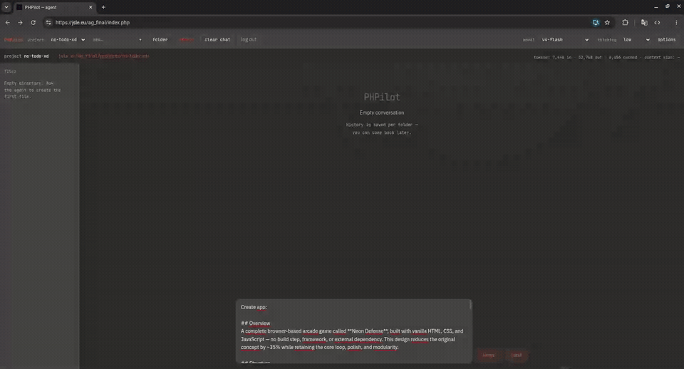

# PHPilot

**Edit websites on ordinary PHP hosting with an AI coding agent - directly where they already live.**

Upload PHPilot once, open it in your browser, select an existing website and describe what you want changed.

**PHP 8.1+ · no SSH · no Node.js · no Docker · no Composer · no FTP editing loop**

<p align="center">
  
</p>

## Why PHPilot?

A huge number of websites still live on ordinary PHP hosting.

And for many of them, making a small change still looks something like this:

```text
FTP / file manager
      ↓
download files
      ↓
edit locally
      ↓
upload again
      ↓
refresh
      ↓
repeat
````

Modern AI coding agents are extremely capable, but they usually assume a modern development environment around them:

* a terminal
* SSH
* Node.js or Python
* persistent processes
* sometimes Docker or other tooling

That does not help much when the website you want to edit is already sitting on a basic PHP hosting account.

PHPilot takes the opposite approach:

> **Your website is already on the server. Why download it just to let an AI edit it?**

PHPilot runs as a self-contained PHP application on the same hosting account as the websites it edits.

Open it in your browser, select a directory and tell the agent what to change.

```text
"Fix the mobile menu."
"Change the phone number in the footer."
"Add a contact form."
"Make this page match the attached screenshot."
```

PHPilot inspects the project, searches and reads the relevant files, makes the changes and keeps working until the task is complete.

---

## What makes it different?

PHPilot is not a web frontend connected to a hidden Node.js or Python coding agent.

The complete agent runtime runs in PHP.

That includes:

* communication with the AI model
* streaming responses
* tool calling
* execution of filesystem operations
* conversation persistence
* workspace management
* context restoration
* file editing
* browser UI

There is no shell-backed agent process behind it.

No daemon.

No Node.js service.

No Python service.

No Docker container.

No SSH requirement.

Just PHP, HTTP requests and filesystem access.

---

## Features

* runs directly on ordinary PHP hosting
* works with websites already present on the server
* creates new standalone projects
* browser-based interface
* persistent conversation history per workspace
* streaming responses through Server-Sent Events
* built-in file browser and editor
* image attachments for visual tasks
* configurable model options and reasoning
* responsive interface and PWA support
* filesystem sandboxing
* no shell or arbitrary command execution

---

## Filesystem agent

PHPilot gives the model a deliberately small set of filesystem tools:

| Tool                 | Purpose                                        |
| -------------------- | ---------------------------------------------- |
| `list_files`         | list directories and files                     |
| `find_files`         | locate files by name or path                   |
| `search_files`       | search file contents                           |
| `read_file`          | read small files                               |
| `multi_read_files`   | read multiple files or restore project context |
| `read_file_fragment` | read selected portions of large files          |
| `write_file`         | create or rewrite files                        |
| `replace_in_file`    | perform precise edits                          |
| `delete_file`        | delete files or directories                    |
| `create_directory`   | create directories                             |
| `rename_file`        | rename or move files and directories           |

There is deliberately no:

* shell
* `exec()`
* terminal
* package manager
* database tool
* browser automation environment

The model has to solve coding tasks through controlled filesystem operations.

---

## Quick start

### Requirements

* PHP 8.1 or newer
* PHP extensions:

  * `curl`
  * `mbstring`
  * `json`
* write access to the PHPilot directory during installation
* a DeepSeek API key
* HTTPS strongly recommended

### Installation

Upload the contents of `src/` to your hosting account.

For example:

```text
public_html/
├── phpilot/
├── my-website/
└── another-site/
```

Open PHPilot in your browser:

```text
https://example.com/phpilot/
```

The installer checks the environment and asks for:

* administrator password
* DeepSeek API key
* public base URL
* PHPilot URL
* path to `public_html` relative to PHPilot

For the directory structure above, the `public_html` path will usually be:

```text
..
```

After installation:

1. log in
2. open an existing website directory or create a project
3. describe what you want changed
4. let PHPilot work directly on the files

---

## Existing websites

The main use case is working on websites that already exist on the hosting account.

Example:

```text
public_html/
└── company-site/
    ├── index.php
    ├── contact.php
    ├── css/
    ├── js/
    └── images/
```

Instead of downloading the project and moving it into a separate AI development environment, PHPilot works directly on the existing files.

---

## New projects

PHPilot can also create projects from scratch inside its own project directory.

This makes it useful for:

* prototypes
* small applications
* experiments
* landing pages
* utilities
* complete PHP/HTML/JS/CSS projects

The demo at the top of this README shows PHPilot building a browser game using the same filesystem-only agent loop.

---

## Why no shell?

Because the lack of a shell is part of the deployment target.

Adding terminal access, containers, background services and external runtimes would make PHPilot more powerful in general, but would also make it unusable on the hosting environments it was created for.

PHPilot is intentionally built around what basic PHP hosting reliably provides:

```text
PHP
HTTP
filesystem
```

The question behind the project is simple:

> **How capable can a coding agent be when all it has is PHP and controlled filesystem access?**

The answer turned out to be: capable enough to be genuinely useful.

---

## Architecture

```text
Browser
   │
   │ HTTP + SSE
   ▼
PHPilot
   │
   ├── agent loop
   ├── conversation history
   ├── workspace sandbox
   └── filesystem tools
            │
            ▼
       website files

PHPilot
   │
   │ HTTPS API
   ▼
DeepSeek
```

A typical agent loop looks like:

```text
user request
    ↓
inspect project
    ↓
search files
    ↓
read relevant code
    ↓
modify files
    ↓
verify changes
    ↓
continue if necessary
    ↓
final response
```

---

## Context handling

Coding agents can become inefficient when they repeatedly read the same project across long sessions.

PHPilot keeps conversation history and includes a batched `multi_read_files` tool that allows the agent to restore workspace context efficiently.

The application also limits:

* tool rounds
* tool calls per round
* tool result size
* aggregate tool output
* tree depth
* output tokens
* active context size

These limits are intentional.

PHPilot is designed to remain usable on ordinary hosting rather than assume unlimited server resources.

---

## Images

PHPilot can accept screenshots and other reference images for visual tasks.

For example:

```text
"Make this page look like the attached screenshot."
```

or:

```text
"The mobile layout is broken like this. Fix it."
```

Supported image formats:

* JPEG
* PNG
* GIF
* WebP

Up to two images can be attached to a message.

---

## Security

PHPilot can modify website files.

Treat it like any other administrative development tool.

It is designed for a single trusted administrator, not as a public multi-user service.

Current protections include:

* password-protected access
* hashed administrator password
* `HttpOnly` session cookies
* `SameSite=Strict`
* `Secure` cookies when HTTPS is used
* CSRF protection
* workspace path validation
* path traversal protection
* symlink rejection
* filesystem sandboxing
* no shell execution
* bounded agent and tool output

Recommended deployment practices:

* use HTTPS
* use a long, unique administrator password
* keep backups of websites you edit
* add HTTP authentication, VPN or IP restrictions when available
* make sure secrets and runtime data are not publicly downloadable

PHPilot stores secrets and runtime data locally.

Do not expose `.env`, configuration files or conversation data through the web server.

---

## Current limitations

PHPilot intentionally has a narrow scope.

Current limitations include:

* DeepSeek is currently the supported AI provider
* no shell access
* no arbitrary command execution
* no package installation
* no terminal-based test execution
* no Git-based rollback
* single-administrator design
* hosting execution limits still apply
* best suited to text-based web projects

These are trade-offs of the deployment model rather than hidden limitations.

---

## What PHPilot is not

PHPilot is not intended to replace:

* Claude Code
* Codex
* Cursor
* a full IDE
* Git
* CI/CD
* Docker
* a VPS
* a modern development environment

If you already have SSH, Git, containers and your preferred coding agent available directly on the server, you probably do not need PHPilot.

PHPilot exists for the other case:

> **the website is already sitting on ordinary PHP hosting and you want the AI agent to work there.**

---

## Why I built it

PHPilot started from a very ordinary problem.

I had websites already running on PHP hosting, and making small changes still meant going back to FTP, moving files around and editing them manually.

At the same time, AI coding agents had become extremely capable.

The obvious question was:

> **Why am I still downloading these files instead of letting an AI edit them where they already are?**

PHPilot is my answer to that question.

---

## License

PHPilot is released under the MIT License.
